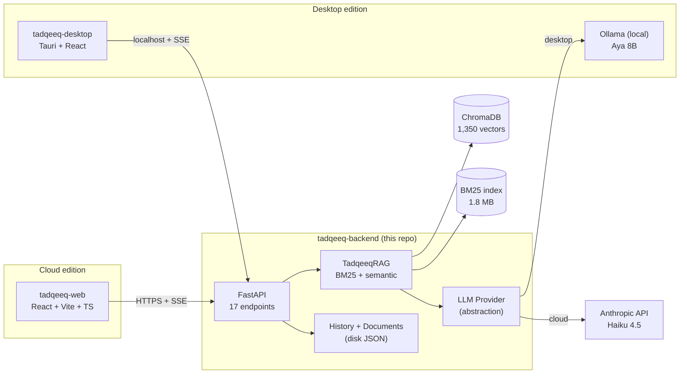

# tadqeeq-backend

[](https://github.com/M-AlAteegi/tadqeeq-backend/actions/workflows/ci.yml)
[](LICENSE)
[](pyproject.toml)
[](https://fastapi.tiangolo.com)

Bilingual (English / Arabic) Islamic-finance RAG service for Saudi (SAMA + CMA)
regulatory compliance. Hybrid retrieval over 1,350 regulatory articles, a curated
Islamic-finance clause library, and document analysis (compliance audit + executive
brief). LLM synthesis is provider-agnostic — runs on Claude (cloud) or Ollama (local
desktop) behind the same REST surface.

## Architecture

This is the **backend** repo. The full v4 architecture is three sibling repos:



| Repo | Status | Role |
|---|---|---|
| **tadqeeq-backend** | live | FastAPI service — RAG, retrieval, LLM providers, analysis, exports |
| `tadqeeq-web` | planned | React + Vite + TypeScript web frontend |
| `tadqeeq-desktop` | planned | Tauri shell bundling local Ollama for data sovereignty |

v3.x predecessor (single-process PyWebView desktop app):
[github.com/M-AlAteegi/TadqeeqAI](https://github.com/M-AlAteegi/TadqeeqAI).

## API surface

17 endpoints across six groups:

| Group | Endpoints |
|---|---|
| Health | `GET /health` |
| Chat | `POST /api/chat/query`, `POST /api/chat/query/stream` (SSE) |
| Chat history | `POST/GET/DELETE /api/chats[/{id}]` |
| Library | `GET /api/library/index`, `GET /api/library/clause/{id}`, `POST /api/library/query[/stream]` |
| Library history | `POST/GET/DELETE /api/library/chats[/{id}]` |
| Analysis | `POST /api/analysis/documents`, `POST/GET .../compliance`, `POST/GET .../brief` |
| Exports | `GET .../export/{markdown\|docx\|pdf}` for chat / library / brief (9 endpoints) |
| Settings | `GET/PATCH /api/settings` |

Full schema at `/docs` (Swagger) and `/redoc` (ReDoc) when the server is running.

## Quickstart (Python)

```powershell
python -m venv .venv
.\.venv\Scripts\Activate.ps1
pip install -r requirements.txt
Copy-Item .env.example .env  # then edit CLAUDE_API_KEY
uvicorn app.main:app --port 8765
```

Open <http://localhost:8765/docs> for the OpenAPI UI, or
<http://localhost:8765/health> for a sanity check.

## Quickstart (Docker)

Assumes Docker Desktop installed and the sibling v3.x repo at `../TadqeeqAI/`
(for the corpus). Override `TADQEEQ_CORPUS_PATH` to point elsewhere.

```bash
export CLAUDE_API_KEY=sk-ant-...
docker compose up --build
```

Mounts `./data` for writable state (chat history, settings, uploaded documents)
and `${TADQEEQ_CORPUS_PATH}` read-only for the SAMA/CMA corpus. To run against
local Ollama from inside the container, set `LLM_PROVIDER=ollama` — the
container reaches the host's Ollama via `host.docker.internal:11434`
(already configured).

## LLM provider abstraction

The same RAG pipeline runs on either provider — only the synthesis step differs:

```python
# app/providers/base.py
class LLMProvider(ABC):
    async def generate(self, *, system, messages, max_tokens, temperature) -> str: ...
    def stream(self, *, system, messages, max_tokens, temperature) -> AsyncIterator[str]: ...
```

- `ClaudeProvider` (`claude-haiku-4-5`) — prompt caching on the system block to
  amortize formatting-instructions tokens across calls in a session.
- `OllamaProvider` — local Aya 8B over HTTP. Used by the desktop edition for
  data sovereignty when source documents can't leave the user's machine.

Provider selection via `LLM_PROVIDER` env var. Misconfiguration (e.g.
`LLM_PROVIDER=claude` with empty `CLAUDE_API_KEY`) fails at startup with a
clear error rather than silently working until the first query.

## Auth + rate limits

- **Bearer token**: set `API_KEY=<secret>` in `.env`. When present, every
  `/api/*` endpoint requires `Authorization: Bearer <secret>` or returns 401.
  `/health` and `/docs` stay open. Empty by default for dev.
- **Per-endpoint rate limits**: `RATE_LIMIT_CHAT` (default `20/minute`),
  `RATE_LIMIT_LIBRARY`, `RATE_LIMIT_BRIEF` (`5/minute` — protects the LLM
  budget), `RATE_LIMIT_UPLOAD` (`10/minute`). Sized for solo dev; tighten
  for public deploys.
- **CORS**: configurable via `CORS_ORIGINS` (comma-separated origins).

## Project layout

```
app/
├── main.py             FastAPI entry, CORS, auth, rate limit, lifespan
├── config.py           pydantic-settings (env-driven)
├── api/                HTTP routers (chat, chats, library, library_chats,
│                       analysis, exports, settings, health)
├── core/
│   ├── rag.py          Hybrid retrieval + generation (BM25 + semantic)
│   ├── library.py      Curated clause library
│   ├── history.py      RegularChatStore + LibraryChatStore (REST-stateless)
│   ├── document_store.py   Disk-backed analysis document persistence
│   ├── analysis.py     DocumentProcessor + 6-point ComplianceChecker
│   ├── exports.py      Markdown exports + format_dual_date (Hijri/Greg/dual)
│   ├── exports_docx.py DOCX exports with OOXML Arabic RTL handling
│   ├── exports_pdf.py  PDF exports with Noto Naskh shaping + bidi
│   ├── auth.py         BearerAuthMiddleware
│   └── limits.py       slowapi limiter
├── providers/          LLMProvider ABC + ClaudeProvider + OllamaProvider
├── models/             Pydantic request/response shapes
└── fonts/              Noto Naskh Arabic TTFs (for PDF export)
```

## Tech stack

FastAPI · Pydantic · ChromaDB · BM25 ·
sentence-transformers (`intfloat/multilingual-e5-base`) ·
Anthropic SDK (Haiku 4.5 with prompt caching) · Ollama (Aya 8B) ·
PyMuPDF · python-docx · ReportLab + Noto Naskh Arabic ·
slowapi · hijridate · Docker (multi-stage)

## License

MIT — see [LICENSE](LICENSE).
